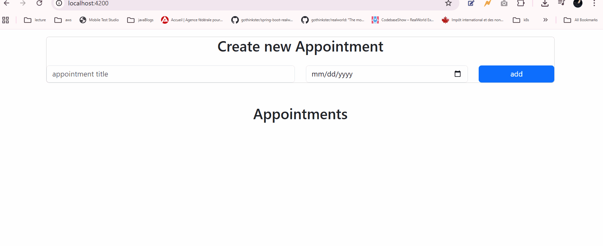

🗓️ Appointment App — Built From Scratch

I built this application entirely from scratch to demonstrate clean architecture, UI design, and state management in Angular.

This app allows users to easily create, manage, and persist appointments:

➕ Create new appointments by selecting a date and adding it to the list

📅 Perfect for simple daily scheduling (ex: picking a date for a mall visit)

📋 View all existing appointments in a clean, intuitive list

❌ Remove appointments with a single click

🔄 Automatic persistence: all appointments remain available even after refreshing the page thanks to browser Local Storage

This project highlights my ability to design a small but fully functional feature end-to-end  from UI/UX to data handling and persistence.